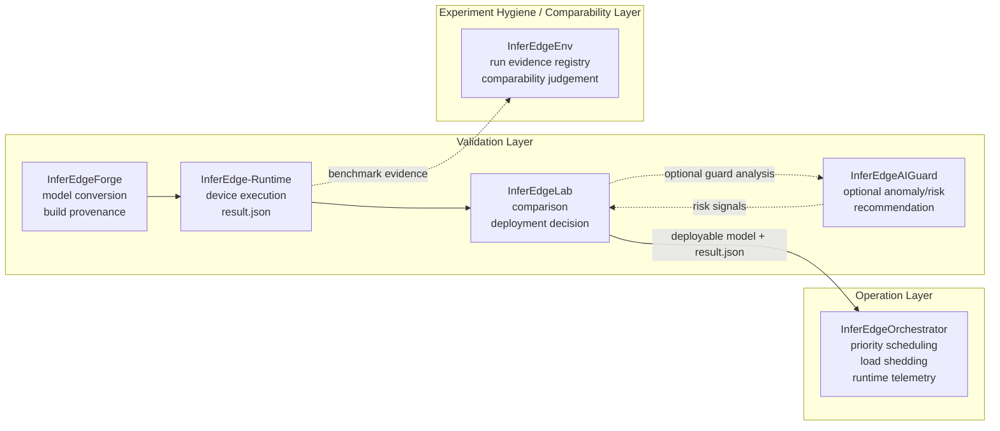

# InferEdgeOrchestrator

Language: [English](README.md) | 한국어

[](https://github.com/gwonxhj/InferEdgeOrchestrator/actions/workflows/ci.yml)

Release: [v0.1.2](https://github.com/gwonxhj/InferEdgeOrchestrator/releases/tag/v0.1.2)

InferEdgeOrchestrator는 제한된 Edge 디바이스를 위한 배포 이후 runtime operation
control layer이자 lightweight scheduler다. 배포 이후 여러 inference task가 동시에
들어오는 상황에서 task별 priority, latency budget, bounded queue, load shedding,
telemetry를 기준으로 실행을 제어해 high-priority workload가 backlog와 latency spike
상황에서도 최대한 응답성을 유지하도록 한다.

이 프로젝트는 Triton이나 DeepStream을 대체하려는 시스템이 아니다.
overload-control 결정을 명시적이고 테스트 가능하며 설명 가능한 형태로
보여주는 runtime operation-control layer다.

목표는 maximum-throughput serving이 아니다. 제한된 Edge workload에서 inference
behavior를 제어 가능하게 만드는 것이 목표다.

Portfolio positioning: Triton/DeepStream 대체나 throughput serving이 아니라
deployment 이후 runtime operation control.

Portfolio brief: [PORTFOLIO.ko.md](PORTFOLIO.ko.md) ([English](PORTFOLIO.md))

## 30-Second Read

- 배포 이후 운영 문제에 집중한다. Edge inference task가 제한된 자원을 두고
  경쟁할 때 무엇을 먼저 실행하고, 무엇을 drop하며, 왜 그런 결정을 했는지 다룬다.
- Priority/deadline-aware scheduling, bounded queue, adaptive load shedding으로
  high-priority workload를 보호한다.
- 작업을 조용히 버리지 않는다. overload decision, drop reason, 보호된 task를
  structured telemetry evidence로 남긴다.
- Forge `agent_manifest.json`과 Runtime `result.agent` metadata를
  `inferedge-orchestration-summary-v1` scheduling evidence contract로 연결한다.
- Local pytest, GitHub Actions package/CLI smoke, synthetic overload comparison,
  Jetson dummy/ONNX smoke, Jetson TensorRT-backed contention evidence로 검증했다.

## What It Does

| Runtime concern | Implementation |
| --- | --- |
| Multi-task inference | detector/classifier/OCR 같은 workload를 config 기반 task로 등록 |
| Priority control | `priority`, `latency_budget_ms` 기반 priority/deadline-aware scheduling |
| Backlog control | task별 bounded queue와 `drop_oldest`, `drop_newest`, low-priority shedding |
| Overload stability | low-priority work를 제한해 high-priority latency 보호 |
| Worker abstraction | `dummy`, `onnxruntime`, TensorRT-backed worker를 같은 interface로 실행 |
| Runtime evidence | executed/dropped count, latency, backlog, result event, resource snapshot, policy decision을 telemetry JSON으로 기록 |
| Agent contract bridge | Forge agent manifest와 Runtime agent result를 task에서 optional 참조하고 orchestration summary evidence로 export |
| Remote dispatch starter | file-based worker registry와 task request contract로 edge worker를 선택하고 worker-selection, fallback, plan-only, compact event-summary, optional HTTP/SSH starter evidence를 기록하되 production remote execution을 주장하지 않음 |
| Jetson smoke coverage | Jetson Orin Nano smoke script로 CLI, telemetry, `tegrastats` parsing, ONNX Runtime execution, TensorRT-backed contention 경로를 실행 |

## Runtime Model

```text
Input Source
-> Frame Router
-> Bounded Task Queues
-> Priority + Deadline-Aware Scheduler
-> Inference Worker
-> Result Aggregator
-> Telemetry Logger
```

각 task는 운영 정책으로 정의된다.

```json
{
  "name": "detector",
  "model_path": "models/detector.onnx",
  "priority": 100,
  "target_fps": 15,
  "latency_budget_ms": 80,
  "queue_size": 4,
  "drop_policy": "drop_oldest",
  "worker": "dummy"
}
```

scheduler의 목적은 모든 frame을 끝까지 처리하는 것이 아니다. 다음에 실행할
task를 선택하고, stale frame을 drop하며, overload 상황에서 low-priority
work를 제한해 high-priority latency가 budget 안에 머물도록 제어한다.

## InferEdge Ecosystem Boundary

InferEdge는 배포 가능성을 검증한다. InferEdgeEnv는 benchmark evidence가
신뢰 및 비교 가능한지 기록한다. InferEdgeOrchestrator는 배포된 workload가
overload 상황에서도 안정적으로 동작하도록 제어한다.



이 경계는 의도적이다.

- InferEdge는 모델이 배포 가능한지 판단한다.
- InferEdgeEnv는 benchmark evidence가 신뢰 및 비교 가능한지 판단한다.
- InferEdgeOrchestrator는 배포된 inference task들이 함께 실행될 때의 운영을 제어한다.
- Orchestrator 연동은 직접 import가 아니라 `result.json` 파일 기반으로 유지된다.
- sustained Orchestrator report에는 additive `edgeenv_runtime_telemetry_feed`
  block이 포함되어 EdgeEnv/AIGuard/Lab이 queue, deadline, fallback, resource
  context를 재사용할 수 있다. 단, Orchestrator가 regression 또는 deployment
  decision owner가 되는 것은 아니다.
- standalone feed는 `source_repository=InferEdgeOrchestrator`,
  `artifact_role=orchestrator-supplemental-operation-context`,
  `producer_contract=inferedge-orchestrator-edgeenv-runtime-telemetry-feed-v1`를
  선언해 Lab/EdgeEnv handoff check가 deployment ownership을 바꾸지 않고
  producer를 식별할 수 있게 한다.
- 이 feed는 mapping contract를 명시한다. Orchestrator는 supplemental candidate
  operation context를 제공하고, history-level telemetry coverage summary의 owner는
  EdgeEnv로 유지한다.
- 또한 feed는 `producer_lineage_evidence_type=edgeenv_orchestrator_producer_lineage`
  downstream guard alignment를 선언해 AIGuard/Lab이 producer-lineage reasoning을
  보존하더라도 Orchestrator가 final decision owner가 되지 않게 한다.
- device-local producer trace는 additive `candidate_context.producer`
  evidence로 feed에 보존된다. 여기에는 producer sources, task별 producer stage,
  device-local event count가 포함되며, EdgeEnv가 override lineage를 보존하더라도
  Orchestrator가 comparability 또는 regression owner가 되지는 않는다.
- standalone feed writer는 `coverage_summary_owner=edgeenv`,
  `coverage_summary_path=runtime_telemetry_context.history.telemetry_coverage`,
  `operation_context_role=supplemental`, 그리고 EdgeEnv/AIGuard/Lab이 사용하는
  candidate context 필수 필드를 검증한다. 또한 `aiguard_evidence_candidates`가
  `runtime_queue_overload`, `runtime_thermal_instability`를 유지하는지 확인해
  downstream diagnosis/report fixture의 deterministic anomaly 경계를 보존한다.

## Implementation Map

| Phase | Delivered capability | Evidence |
| --- | --- | --- |
| Phase 1: Scheduler Core | config schema, dummy frame source, bounded queue, priority/deadline scheduler, dummy worker, load shedding, telemetry export | scheduler, queue, shedding, telemetry pytest |
| Phase 2: ONNX Runtime Worker | config로 선택 가능한 ONNX Runtime worker, identity ONNX smoke model, image/video input path | `configs/phase2_onnx_demo.json`, `scripts/create_identity_onnx.py` |
| Phase 3: Overload Scenario | FIFO baseline과 scheduler/load-shedding 결과 비교 | `python3 -m inferedge_orchestrator compare-overload ...` |
| Phase 4: Jetson Smoke | Jetson CLI smoke, telemetry 생성, resource snapshot, optional `tegrastats` parsing | `scripts/smoke_jetson_dummy.sh`, `scripts/smoke_jetson_onnx.sh` |
| Phase 5: InferEdge Handoff | `result.json` latency signal을 Orchestrator task config로 변환 | `python3 -m inferedge_orchestrator from-inferedge ...` |
| Agent Runtime Contract | Forge agent manifest와 Runtime `result.agent` 참조를 사용하는 Vision / Voice-Command / Safety-Monitor dummy workload | `configs/agent_3_workload_demo.json`, [`docs/agent_orchestration_summary_contract.ko.md`](docs/agent_orchestration_summary_contract.ko.md) |
| Lightweight Sustained Workload Starter | YOLO-like vision, Whisper-like command burst, FastAPI-style ingress, optional tegrastats timeline, producer-backed starter를 포함한 profiled local sustained scenario | `python3 -m inferedge_orchestrator run-multi-workload-sustained ...` |
| Device-Local Sustained Starter | committed image/request/resource snapshot producer를 하나의 `device_local` mode로 실행하는 starter | `configs/agent_multi_workload_sustained_device_local.json` |
| EdgeEnv Telemetry Feed Candidate | Orchestrator queue/deadline/fallback/resource context를 EdgeEnv runtime telemetry context candidate로 매핑하는 additive sustained report block | sustained report의 `edgeenv_runtime_telemetry_feed` |
| Remote Dispatch Starter | production remote execution을 주장하지 않고 file-based worker registry와 task request contract로 remote edge worker selection, 명시적 HTTP/SSH starter 실행, bounded fallback evidence를 검증 | [`docs/remote_dispatch_starter.ko.md`](docs/remote_dispatch_starter.ko.md) |

Remote dispatch starter boundary:

- 구현됨: file-based worker registry ingestion, selected/rejected worker
  evidence, bounded fallback recovery context, remote runtime event count
  alias, `operation_boundary=remote dispatch starter evidence only`,
  `remote_execution_recovered_by_fallback` 같은 Lab/AIGuard-facing signal name.
- 미구현: production remote execution, long-lived worker lifecycle, secure
  tunnel operation, production SSH/HTTP dispatch hardening, production
  retry/failover orchestration, cloud control plane behavior.
- 리뷰 의미: Orchestrator는 downstream review를 위한 operation evidence를
  생산하고, AIGuard는 필요 시 deterministic warning context를 제공하며,
  최종 deployment decision owner는 Lab으로 유지된다.

## Validation Evidence

아래 결과는 benchmark 주장이 아니라 lifecycle evidence다. smoke run은 edge
hardware에서 runtime path가 실행됨을 보여주고, synthetic overload run은
scheduler policy를 검증하며, InferEdge handoff는 validation과 operation
control이 파일 기반 경계로 연결됨을 보여준다.

| Evidence | Key result | Artifact |
| --- | --- | --- |
| Jetson dummy smoke | `nano01`에서 telemetry, resource snapshot, low-priority drop 확인: detector `20/0`, classifier `2/18` executed/dropped | [`examples/telemetry/jetson_smoke_dummy_sample.json`](examples/telemetry/jetson_smoke_dummy_sample.json) |
| Jetson ONNX Runtime smoke | Jetson에서 `onnxruntime` worker가 identity ONNX를 `CPUExecutionProvider`로 실행, output shape `[1, 2]`, `tegrastats` sample 13개 | [`examples/telemetry/jetson_onnx_smoke_sample.json`](examples/telemetry/jetson_onnx_smoke_sample.json) |
| Jetson TensorRT inference smoke | Jetson에서 identity ONNX로 `models/identity_fp16.plan`을 생성하고 TensorRT identity frame 1개 실행 및 runtime telemetry metadata 확인: `PASS_TENSORRT_INFERENCE`, `PASS_TENSORRT_TELEMETRY` | [`docs/validation_evidence.ko.md`](docs/validation_evidence.ko.md) |
| Jetson TensorRT contention smoke | high-priority/low-priority TensorRT task를 scheduler/load-shedding contention으로 실행: `PASS_TENSORRT_CONTENTION` | [`examples/telemetry/jetson_tensorrt_contention_sample.json`](examples/telemetry/jetson_tensorrt_contention_sample.json) |
| Jetson TensorRT diverse contention smoke | 서로 다른 generated detector/classifier TensorRT engine을 scheduler/load-shedding contention으로 실행: detector `6/0`, classifier `1/5` executed/dropped, overload event `5`, `PASS_TENSORRT_DIVERSE_CONTENTION` | [`examples/telemetry/jetson_tensorrt_diverse_contention_sample.json`](examples/telemetry/jetson_tensorrt_diverse_contention_sample.json) |
| Synthetic overload comparison | detector p95 end-to-end latency가 FIFO baseline `782.0ms`에서 scheduler + shedding `8.0ms`로 개선, classifier low-priority frame 16개 drop | [`examples/telemetry/phase3_overload_sample.json`](examples/telemetry/phase3_overload_sample.json) |
| InferEdge result handoff | sample `expected_latency_ms=42.2`에서 recommended `latency_budget_ms=64.0` 생성, InferEdge internals import 없음 | `configs/from_inferedge.json` |

versioned sample telemetry artifact는 `examples/telemetry/`
([English](examples/telemetry/README.md))에서 확인할 수 있다.
전체 evidence index는 `docs/validation_evidence.ko.md`
([English](docs/validation_evidence.md))에서 확인할 수 있다.

### Jetson Smoke Commands

```bash
CAPTURE_TEGRASTATS=1 scripts/smoke_jetson_dummy.sh
```

```bash
PYTHON_BIN=$HOME/miniconda3/envs/yolo_env/bin/python \
  CAPTURE_TEGRASTATS=1 \
  scripts/smoke_jetson_onnx.sh
```

Latest device records:

| Smoke | Device | OS / L4T | Python | Result | Note |
| --- | --- | --- | --- | --- | --- |
| Dummy scheduler smoke | `nano01` | `Ubuntu 22.04.5 LTS`, `L4T R36.4.7` | `3.10.12` | `PASS` | CLI, telemetry, resource snapshot, low-priority drop |
| ONNX Runtime smoke | `nano01` | `Ubuntu 22.04.5 LTS`, `L4T R36.4.7` | `3.10.12` | `PASS` | ONNX Runtime `1.23.2`, `CPUExecutionProvider`, output metadata 기록 |

이 smoke 기록들은 worker, scheduler, telemetry, Jetson execution path 검증이다.
TensorRT/GPU throughput benchmark가 아니다.

### Overload Comparison

```bash
python3 -m inferedge_orchestrator compare-overload \
  --config configs/phase3_overload.json \
  --output reports/phase3_overload.json \
  --frames 20
```

| Mode | Detector executed | Detector dropped | Detector p95 end-to-end latency | Classifier executed | Classifier dropped | Overload events |
| --- | ---: | ---: | ---: | ---: | ---: | ---: |
| FIFO baseline | 20 | 0 | 782.0ms | 20 | 0 | 0 |
| Scheduler + load shedding | 20 | 0 | 8.0ms | 4 | 16 | 16 |

핵심 runtime operation-control story는 명확하다. overload 상황에서 low-priority
classifier work를 의도적으로 drop해 high-priority detector가 latency budget 안에
머무르도록 보호하고, 그 이유를 telemetry로 확인할 수 있다.

### InferEdge Handoff

```bash
python3 -m inferedge_orchestrator from-inferedge \
  --result examples/inferedge_result_sample.json \
  --output configs/from_inferedge.json \
  --task-name detector \
  --model-path models/detector.onnx \
  --priority 100 \
  --target-fps 15 \
  --queue-size 4
```

이 helper는 InferEdge `result.json`의 latency signal을 읽어 Orchestrator
task policy의 초기 `latency_budget_ms`를 추천한다. validation과 operation
control은 artifact로 연결되지만 repository는 분리된 상태를 유지한다.

## Quickstart

test dependency와 함께 local package를 설치한다.

```bash
python3 -m pip install -e '.[dev]'
```

테스트 실행:

```bash
python3 -m pytest
```

scheduler demo 실행:

```bash
python3 -m inferedge_orchestrator run \
  --config configs/phase1_demo.json \
  --output reports/phase1_demo.json \
  --frames 12
```

ONNX Runtime demo 실행:

```bash
python3 -m pip install -e '.[onnx,dev]'
python3 scripts/create_identity_onnx.py --output models/identity.onnx

python3 -m inferedge_orchestrator run \
  --config configs/phase2_onnx_demo.json \
  --output reports/phase2_onnx_demo.json \
  --frames 1
```

telemetry summary 출력:

```bash
python3 -m inferedge_orchestrator report --input reports/phase1_demo.json
```

multi-workload sustained starter 실행:

```bash
python3 -m inferedge_orchestrator run-multi-workload-sustained \
  --config configs/agent_multi_workload_sustained_local.json \
  --output reports/agent_multi_workload_sustained.json \
  --frames 16
```

기본 구현은 lightweight local CPU profile adapter를 사용하므로 YOLO, Whisper,
FastAPI, Jetson dependency를 기본 CI에 강제하지 않는다. Vision starter는 local
image fixture를 읽는 producer도 제공한다.

```bash
python3 -m inferedge_orchestrator run-multi-workload-sustained \
  --config configs/agent_multi_workload_sustained_vision_file.json \
  --output reports/agent_multi_workload_sustained_vision_file.json \
  --frames 16
```

이 경로는 `producer_source=image_file`, input digest, sampled bytes, Vision
workload pressure를 기록하며 ONNX/YOLO integration은 후속 단계로 둔다. Voice
ingress starter는 local FastAPI-style request fixture도 읽을 수 있다.

```bash
python3 -m inferedge_orchestrator run-multi-workload-sustained \
  --config configs/agent_multi_workload_sustained_voice_ingress.json \
  --output reports/agent_multi_workload_sustained_voice_ingress.json \
  --frames 16
```

이 경로는 실제 FastAPI server나 Whisper backend를 실행하지 않고
`producer_source=fastapi_request_fixture`, selected routes, request digest, Voice
burst pressure를 기록한다. Safety monitor starter는 local resource snapshot도 읽을
수 있다.

```bash
python3 -m inferedge_orchestrator run-multi-workload-sustained \
  --config configs/agent_multi_workload_sustained_safety_resource.json \
  --output reports/agent_multi_workload_sustained_safety_resource.json \
  --frames 16
```

이 경로는 `producer_source=resource_snapshot_fixture`, CPU/memory/temperature
signal, fallback/deadline signal, deterministic degradation score를 기록하며 live
device monitor integration은 후속 단계로 둔다.

세 producer fixture를 하나의 명시적 `device_local` mode로 실행하려면 다음을 사용한다.

```bash
python3 -m inferedge_orchestrator run-multi-workload-sustained \
  --config configs/agent_multi_workload_sustained_device_local.json \
  --output reports/agent_multi_workload_sustained_device_local.json \
  --edgeenv-feed-output reports/edgeenv_runtime_telemetry_feed.json \
  --frames 16
```

이 경로는 `producer_sources`, `device_local_producer_count`, Vision image, Voice
request, Safety resource evidence를 기록하며 live YOLO/ONNX, FastAPI,
tegrastats, Jetson/RPi producer는 후속 integration으로 둔다.
선택적 `--edgeenv-feed-output`은 같은 `edgeenv_runtime_telemetry_feed` block을
standalone JSON artifact로 저장한다. 이 파일은 EdgeEnv의
`edgeenv runs telemetry export-history --orchestrator-feed` 입력으로 사용할 수
있다. 단, 이 feed는 supplemental operation context이며 regression judgement나
deployment decision이 아니다.
device-local run에서는 `candidate_context.producer` 아래에
`producer_sources`, `producer_sources_by_task`, `producer_stage_by_task`,
device-local event count도 함께 보존된다.
feed export는 EdgeEnv/AIGuard/Lab handoff marker를 쓰기 전에 검증하므로,
오래된 mapping hint는 downstream bundle gate에 도달하기 전에 로컬에서 실패한다.
또한 `producer_lineage_evidence_type=edgeenv_orchestrator_producer_lineage`
downstream guard alignment marker를 검증해 producer-lineage evidence가
queue/thermal operation evidence와 섞이지 않게 한다.
저장된 feed에 standalone contract gate를 직접 실행할 수도 있다.

```bash
python3 scripts/check_edgeenv_runtime_feed_contract.py \
  --feed reports/edgeenv_runtime_telemetry_feed.json \
  --require-device-local-producer
```

이 gate는 ownership marker와 device-local producer lineage만 확인한다.
또한 device-local source가 global source list, task별 source mapping,
stage mapping, 양수 event count에 계속 남아 있는지 확인한다. EdgeEnv
comparability를 계산하거나 Lab deployment decision을 내리지 않는다.

config를 수정하지 않고 실행 시점에 committed producer fixture를 로컬 입력으로
교체할 수도 있다. `--vision-input`은 단일 image/video file 또는 image frame
directory를 받을 수 있으며, directory는 sustained run 동안 deterministic image
sequence로 순환 처리된다.

```bash
python3 -m inferedge_orchestrator run-multi-workload-sustained \
  --config configs/agent_multi_workload_sustained_device_local.json \
  --output reports/agent_multi_workload_sustained_device_local.json \
  --frames 16 \
  --vision-input /path/to/frame-or-image-sequence \
  --voice-ingress-payload /path/to/requests.json \
  --resource-snapshot /path/to/resources.json
```

Safety producer에 현재 프로세스 리소스 스냅샷을 최소 입력으로 넣고 싶다면
`--resource-snapshot` 대신 `--capture-process-resource-snapshot`을 사용한다. CLI는
output JSON 옆에 작은 process resource snapshot을 생성하고 이를 Safety producer에
연결한다.

자세한 문서:

- `CHANGELOG.ko.md` ([English](CHANGELOG.md))
- `PORTFOLIO.ko.md` ([English](PORTFOLIO.md))
- `configs/README.ko.md` ([English](configs/README.md))
- `examples/telemetry/README.ko.md` ([English](examples/telemetry/README.md))
- `docs/validation_evidence.ko.md` ([English](docs/validation_evidence.md))
- `docs/architecture.ko.md` ([English](docs/architecture.md))
- `docs/jetson_smoke_test.ko.md` ([English](docs/jetson_smoke_test.md))
- `docs/inferedge_integration.ko.md` ([English](docs/inferedge_integration.md))
- `docs/tensorrt_backend.ko.md` ([English](docs/tensorrt_backend.md))
- `docs/tensorrt_engine_build.ko.md` ([English](docs/tensorrt_engine_build.md))
- `docs/tensorrt_model_diversity.ko.md` ([English](docs/tensorrt_model_diversity.md))
