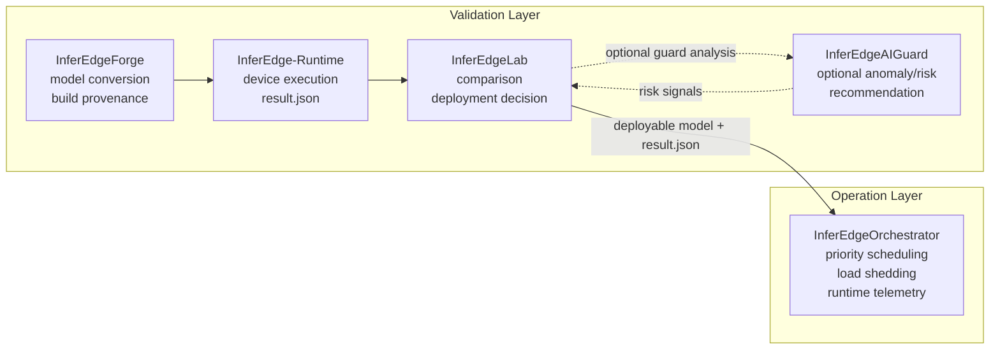

# InferEdgeOrchestrator

Language: [English](README.md) | 한국어

[](https://github.com/gwonxhj/InferEdgeOrchestrator/actions/workflows/ci.yml)

InferEdgeOrchestrator는 제한된 Edge 디바이스를 위한 lightweight runtime
scheduler이다. 배포 이후 여러 inference task가 동시에 들어오는 상황에서
task별 priority, latency budget, bounded queue, load shedding, telemetry를
기준으로 실행을 제어해 high-priority workload가 backlog와 latency spike
상황에서도 최대한 응답성을 유지하도록 한다.

이 프로젝트는 Triton이나 DeepStream을 대체하려는 시스템이 아니다.
overload-control 결정을 명시적이고 테스트 가능하며 설명 가능한 형태로
보여주는 scheduler 중심 edge runtime layer다.

Portfolio positioning: Triton/DeepStream 대체가 아니라 lightweight edge scheduler.

## What It Does

| Runtime concern | Implementation |
| --- | --- |
| Multi-task inference | detector/classifier/OCR 같은 workload를 config 기반 task로 등록 |
| Priority control | `priority`, `latency_budget_ms` 기반 priority/deadline-aware scheduling |
| Backlog control | task별 bounded queue와 `drop_oldest`, `drop_newest`, low-priority shedding |
| Overload stability | low-priority work를 제한해 high-priority latency 보호 |
| Worker abstraction | `dummy`, `onnxruntime` worker를 같은 interface로 실행 |
| Runtime evidence | executed/dropped count, latency, backlog, result event, resource snapshot, policy decision을 telemetry JSON으로 기록 |
| Edge validation | Jetson Orin Nano smoke script로 CLI, telemetry, `tegrastats` parsing, ONNX Runtime worker 실행 검증 |

## Runtime Model

```text
Input Source
-> Frame Router
-> Bounded Task Queues
-> Priority + Deadline-Aware Scheduler
-> Inference Worker
-> Result Aggregator
-> Telemetry Logger
```

각 task는 운영 정책으로 정의된다.

```json
{
  "name": "detector",
  "model_path": "models/detector.onnx",
  "priority": 100,
  "target_fps": 15,
  "latency_budget_ms": 80,
  "queue_size": 4,
  "drop_policy": "drop_oldest",
  "worker": "dummy"
}
```

scheduler의 목적은 모든 frame을 끝까지 처리하는 것이 아니다. 다음에 실행할
task를 선택하고, stale frame을 drop하며, overload 상황에서 low-priority
work를 제한해 high-priority latency가 budget 안에 머물도록 제어한다.

## InferEdge Boundary

InferEdge는 deployment validation pipeline이고, InferEdgeOrchestrator는
runtime operation control layer다.



이 경계는 의도적이다.

- InferEdge는 모델이 배포 가능한지 판단한다.
- InferEdgeOrchestrator는 배포된 inference task들이 함께 실행될 때의 운영을 제어한다.
- 두 프로젝트는 직접 import가 아니라 `result.json` 파일로만 연결된다.

## Implementation Map

| Phase | Delivered capability | Evidence |
| --- | --- | --- |
| Phase 1: Scheduler Core | config schema, dummy frame source, bounded queue, priority/deadline scheduler, dummy worker, load shedding, telemetry export | scheduler, queue, shedding, telemetry pytest |
| Phase 2: ONNX Runtime Worker | config로 선택 가능한 ONNX Runtime worker, identity ONNX smoke model, image/video input path | `configs/phase2_onnx_demo.json`, `scripts/create_identity_onnx.py` |
| Phase 3: Overload Scenario | FIFO baseline과 scheduler/load-shedding 결과 비교 | `python3 -m inferedge_orchestrator compare-overload ...` |
| Phase 4: Jetson Smoke | Jetson CLI smoke, telemetry 생성, resource snapshot, optional `tegrastats` parsing | `scripts/smoke_jetson_dummy.sh`, `scripts/smoke_jetson_onnx.sh` |
| Phase 5: InferEdge Handoff | `result.json` latency signal을 Orchestrator task config로 변환 | `python3 -m inferedge_orchestrator from-inferedge ...` |

## Validation Evidence

아래 결과는 benchmark 주장이 아니라 lifecycle evidence다. smoke run은 edge
hardware에서 runtime path가 실행됨을 보여주고, synthetic overload run은
scheduler policy를 검증하며, InferEdge handoff는 validation과 operation
control이 파일 기반 경계로 연결됨을 보여준다.

| Evidence | Key result | Artifact |
| --- | --- | --- |
| Jetson dummy smoke | `nano01`에서 telemetry, resource snapshot, low-priority drop 확인: detector `20/0`, classifier `2/18` executed/dropped | `reports/jetson_smoke_dummy.json` |
| Jetson ONNX Runtime smoke | Jetson에서 `onnxruntime` worker가 identity ONNX를 `CPUExecutionProvider`로 실행, output shape `[1, 2]`, `tegrastats` sample 13개 | `reports/jetson_onnx_smoke.json` |
| Synthetic overload comparison | detector p95 end-to-end latency가 FIFO baseline `782.0ms`에서 scheduler + shedding `8.0ms`로 개선, classifier low-priority frame 16개 drop | `reports/phase3_overload.json` |
| InferEdge result handoff | sample `expected_latency_ms=42.2`에서 recommended `latency_budget_ms=64.0` 생성, InferEdge internals import 없음 | `configs/from_inferedge.json` |

### Jetson Smoke Commands

```bash
CAPTURE_TEGRASTATS=1 scripts/smoke_jetson_dummy.sh
```

```bash
PYTHON_BIN=$HOME/miniconda3/envs/yolo_env/bin/python \
  CAPTURE_TEGRASTATS=1 \
  scripts/smoke_jetson_onnx.sh
```

Latest device records:

| Smoke | Device | OS / L4T | Python | Result | Note |
| --- | --- | --- | --- | --- | --- |
| Dummy scheduler smoke | `nano01` | `Ubuntu 22.04.5 LTS`, `L4T R36.4.7` | `3.10.12` | `PASS` | CLI, telemetry, resource snapshot, low-priority drop |
| ONNX Runtime smoke | `nano01` | `Ubuntu 22.04.5 LTS`, `L4T R36.4.7` | `3.10.12` | `PASS` | ONNX Runtime `1.23.2`, `CPUExecutionProvider`, output metadata 기록 |

ONNX smoke는 worker path 검증이지 TensorRT/GPU benchmark 성능 검증이 아니다.

### Overload Comparison

```bash
python3 -m inferedge_orchestrator compare-overload \
  --config configs/phase3_overload.json \
  --output reports/phase3_overload.json \
  --frames 20
```

| Mode | Detector executed | Detector dropped | Detector p95 end-to-end latency | Classifier executed | Classifier dropped | Overload events |
| --- | ---: | ---: | ---: | ---: | ---: | ---: |
| FIFO baseline | 20 | 0 | 782.0ms | 20 | 0 | 0 |
| Scheduler + load shedding | 20 | 0 | 8.0ms | 4 | 16 | 16 |

핵심 scheduler story는 명확하다. overload 상황에서 low-priority classifier
work를 의도적으로 drop해 high-priority detector가 latency budget 안에
머무르도록 보호한다.

### InferEdge Handoff

```bash
python3 -m inferedge_orchestrator from-inferedge \
  --result examples/inferedge_result_sample.json \
  --output configs/from_inferedge.json \
  --task-name detector \
  --model-path models/detector.onnx \
  --priority 100 \
  --target-fps 15 \
  --queue-size 4
```

이 helper는 InferEdge `result.json`의 latency signal을 읽어 Orchestrator
task policy의 초기 `latency_budget_ms`를 추천한다. validation과 operation
control은 artifact로 연결되지만 repository는 분리된 상태를 유지한다.

## Quickstart

test dependency와 함께 local package를 설치한다.

```bash
python3 -m pip install -e '.[dev]'
```

테스트 실행:

```bash
python3 -m pytest
```

scheduler demo 실행:

```bash
python3 -m inferedge_orchestrator run \
  --config configs/phase1_demo.json \
  --output reports/phase1_demo.json \
  --frames 12
```

ONNX Runtime demo 실행:

```bash
python3 -m pip install -e '.[onnx,dev]'
python3 scripts/create_identity_onnx.py --output models/identity.onnx

python3 -m inferedge_orchestrator run \
  --config configs/phase2_onnx_demo.json \
  --output reports/phase2_onnx_demo.json \
  --frames 1
```

telemetry summary 출력:

```bash
python3 -m inferedge_orchestrator report --input reports/phase1_demo.json
```

자세한 문서:

- `docs/jetson_smoke_test.ko.md` ([English](docs/jetson_smoke_test.md))
- `docs/inferedge_integration.ko.md` ([English](docs/inferedge_integration.md))
