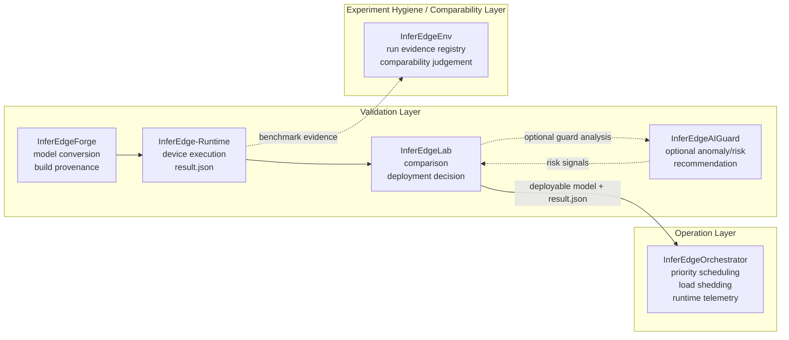

# InferEdgeOrchestrator

Language: English | [한국어](README.ko.md)

[](https://github.com/gwonxhj/InferEdgeOrchestrator/actions/workflows/ci.yml)

Release: [v0.1.2](https://github.com/gwonxhj/InferEdgeOrchestrator/releases/tag/v0.1.2)

InferEdgeOrchestrator is a post-deployment runtime operation-control layer and
lightweight scheduler for constrained edge devices. It controls multiple
inference tasks after deployment, using per-task priority, latency budgets,
bounded queues, load shedding, and telemetry so high-priority workloads stay
responsive when backlog and latency spikes appear.

It is not a Triton or DeepStream replacement. The project is a runtime
operation-control layer that makes overload-control decisions explicit,
testable, and explainable.

The goal is not maximum-throughput serving. The goal is controllable inference
behavior under constrained edge workloads.

Portfolio positioning: post-deployment runtime operation control, not
Triton/DeepStream replacement or throughput serving.

Portfolio brief: [PORTFOLIO.md](PORTFOLIO.md) ([한국어](PORTFOLIO.ko.md))

## 30-Second Read

- Solves the post-deployment operation problem: what runs first, what gets
  dropped, and why, when edge inference tasks contend for limited resources.
- Protects high-priority workloads with priority/deadline-aware scheduling,
  bounded queues, and adaptive load shedding.
- Does not silently drop work: overload decisions, drop reasons, and protected
  tasks are recorded as structured telemetry evidence.
- Connects Forge `agent_manifest.json` and Runtime `result.agent` metadata to
  an `inferedge-orchestration-summary-v1` scheduling evidence contract.
- Validated with local pytest, GitHub Actions package/CLI smoke, synthetic
  overload comparison, Jetson dummy/ONNX smoke, and Jetson TensorRT-backed
  contention evidence.

## What It Does

| Runtime concern | Implementation |
| --- | --- |
| Multi-task inference | Config-driven task registration for detector/classifier/OCR-style workloads |
| Priority control | Priority and deadline-aware scheduling based on `priority` and `latency_budget_ms` |
| Backlog control | Bounded per-task queues with `drop_oldest`, `drop_newest`, and low-priority shedding behavior |
| Overload stability | Adaptive load shedding limits low-priority work to protect high-priority latency |
| Worker abstraction | Shared worker interface with `dummy`, `onnxruntime`, and TensorRT-backed workers |
| Runtime evidence | Telemetry JSON records executed/dropped counts, latency, backlog, result events, resource snapshots, and policy decisions |
| Agent contract bridge | Optional task references to Forge agent manifests and Runtime agent results, exported as orchestration summary evidence |
| Remote dispatch starter | File-based worker registry + task request contract selects an edge worker and records worker-selection, fallback, plan-only, compact event-summary, and optional explicit HTTP/SSH starter evidence without claiming production remote execution |
| Jetson smoke coverage | Jetson Orin Nano smoke scripts exercise CLI, telemetry, `tegrastats` parsing, ONNX Runtime execution, and TensorRT-backed contention |

## Runtime Model

```text
Input Source
-> Frame Router
-> Bounded Task Queues
-> Priority + Deadline-Aware Scheduler
-> Inference Worker
-> Result Aggregator
-> Telemetry Logger
```

Each task is defined by operational policy:

```json
{
  "name": "detector",
  "model_path": "models/detector.onnx",
  "priority": 100,
  "target_fps": 15,
  "latency_budget_ms": 80,
  "queue_size": 4,
  "drop_policy": "drop_oldest",
  "worker": "dummy"
}
```

The scheduler's job is not to run every frame. It decides which task should run
next, which frames are stale enough to drop, and when low-priority work should
be limited so high-priority latency remains inside budget.

## InferEdge Ecosystem Boundary

InferEdge validates deployability. InferEdgeEnv records whether benchmark
evidence can be trusted and compared. InferEdgeOrchestrator controls deployed
workloads under load.



The boundary is intentional:

- InferEdge answers whether a model is safe and reasonable to deploy.
- InferEdgeEnv answers whether benchmark evidence can be trusted and compared.
- InferEdgeOrchestrator controls how deployed inference tasks behave together.
- Orchestrator integration is file-based through `result.json`, not direct imports.
- Sustained Orchestrator reports include an additive `edgeenv_runtime_telemetry_feed`
  block so EdgeEnv/AIGuard/Lab can reuse queue, deadline, fallback, and resource
  context without treating Orchestrator as the regression or deployment-decision owner.
- The feed preserves task-level runtime event rollups through
  `candidate_context.operation.runtime_task_event_summary`, plus
  `tasks_with_deadline_miss`, `tasks_with_fallback`, and
  `tasks_with_scheduler_delay`, so reviewers can trace which workload was
  delayed or limited without replaying the full event timeline.
- The standalone feed declares `source_repository=InferEdgeOrchestrator`,
  `artifact_role=orchestrator-supplemental-operation-context`, and
  `producer_contract=inferedge-orchestrator-edgeenv-runtime-telemetry-feed-v1`
  so Lab/EdgeEnv handoff checks can identify the producer without changing
  deployment ownership.
- The feed declares its mapping contract explicitly: Orchestrator provides
  supplemental candidate operation context, while EdgeEnv remains the owner of
  history-level telemetry coverage summaries.
- The feed also declares downstream guard alignment with
  `producer_lineage_evidence_type=edgeenv_orchestrator_producer_lineage` so
  AIGuard/Lab can preserve producer-lineage reasoning without making
  Orchestrator the final decision owner.
- Device-local producer traces are preserved inside the feed as additive
  `candidate_context.producer` evidence, including producer sources, per-task
  producer stages, and device-local event counts. This lets EdgeEnv preserve
  override lineage without making Orchestrator a comparability or regression
  owner.
- The standalone feed writer validates that the mapping hint keeps
  `coverage_summary_owner=edgeenv`,
  `coverage_summary_path=runtime_telemetry_context.history.telemetry_coverage`,
  `operation_context_role=supplemental`, and the required candidate context
  fields used by EdgeEnv, AIGuard, and Lab. It also requires
  `aiguard_evidence_candidates` to keep `runtime_queue_overload` and
  `runtime_thermal_instability` so downstream diagnosis/report fixtures keep
  the same deterministic anomaly boundary.

## Implementation Map

| Phase | Delivered capability | Evidence |
| --- | --- | --- |
| Phase 1: Scheduler Core | Config schema, dummy frame source, bounded queues, priority/deadline scheduler, dummy worker, load shedding, telemetry export | Pytest coverage for scheduler, queue, shedding, and telemetry |
| Phase 2: ONNX Runtime Worker | Config-selectable ONNX Runtime worker, identity ONNX smoke model, image/video input path support | `configs/phase2_onnx_demo.json`, `scripts/create_identity_onnx.py` |
| Phase 3: Overload Scenario | FIFO baseline vs scheduler/load-shedding comparison | `python3 -m inferedge_orchestrator compare-overload ...` |
| Phase 4: Jetson Smoke | Jetson CLI smoke, telemetry generation, resource snapshots, optional `tegrastats` parsing | `scripts/smoke_jetson_dummy.sh`, `scripts/smoke_jetson_onnx.sh` |
| Phase 5: InferEdge Handoff | `result.json` latency signal converted into Orchestrator task config | `python3 -m inferedge_orchestrator from-inferedge ...` |
| Agent Runtime Contract | Vision / Voice-Command / Safety-Monitor dummy workload with Forge agent manifest and Runtime `result.agent` references | `configs/agent_3_workload_demo.json`, [`docs/agent_orchestration_summary_contract.md`](docs/agent_orchestration_summary_contract.md) |
| Sustained Agent Scenario Starter | Normal / overload / sustained-high-load 3-agent modes with queue-depth timeline, latency timeline, and policy decision reasons | `configs/agent_3_workload_sustained_high_load.json` |
| Lightweight Sustained Workload Starter | Profiled local sustained scenario for YOLO-like vision, Whisper-like command burst, FastAPI-style ingress, optional tegrastats timeline, and producer-backed starters | `python3 -m inferedge_orchestrator run-multi-workload-sustained ...` |
| Device-Local Sustained Starter | Device-local mode using committed image, request, and resource snapshot producers before live device integrations | `configs/agent_multi_workload_sustained_device_local.json` |
| EdgeEnv Telemetry Feed Candidate | Additive sustained report block that maps Orchestrator queue/deadline/fallback/resource context into an EdgeEnv runtime telemetry context candidate | `edgeenv_runtime_telemetry_feed` in sustained reports |
| Remote Dispatch Starter | File-based worker registry and task request contract for selecting a remote edge worker; optional `--execute-plan` records explicit HTTP/SSH starter and bounded fallback evidence without claiming production remote execution | [`docs/remote_dispatch_starter.md`](docs/remote_dispatch_starter.md) |

Remote dispatch starter boundary:

- Implemented: file-based worker registry ingestion, selected/rejected worker
  evidence, bounded fallback recovery context, remote runtime event count
  aliases, `operation_boundary=remote dispatch starter evidence only`, and
  Lab/AIGuard-facing signal names such as
  `remote_execution_recovered_by_fallback`.
- Producer marker: `remote_runtime_event_summary` carries
  `evidence_role=remote_dispatch_runtime_event_compact_summary`,
  `operation_boundary=remote dispatch starter evidence only`, and
  `production_remote_execution=false` so the InferEdge entrypoint smoke can
  verify the same boundary through AIGuard, Lab, and evidence-index artifacts.
- Not implemented: production remote execution, long-lived worker lifecycle,
  secure tunnel operation, production SSH/HTTP dispatch hardening, production
  retry/failover orchestration, or cloud control plane behavior.
- Review meaning: Orchestrator produces operation evidence for downstream
  review, while AIGuard may provide deterministic warning context and Lab
  remains the final deployment decision owner.

## Validation Evidence

These results are lifecycle evidence, not benchmark claims. Smoke runs prove the
runtime paths execute on edge hardware; the synthetic overload run proves the
scheduler policy; the InferEdge handoff proves the validation-to-operation file
boundary.

| Evidence | Key result | Artifact |
| --- | --- | --- |
| Jetson dummy smoke | `nano01` generated telemetry, resource snapshots, and low-priority drops: detector `20/0`, classifier `2/18` executed/dropped | [`examples/telemetry/jetson_smoke_dummy_sample.json`](examples/telemetry/jetson_smoke_dummy_sample.json) |
| Jetson ONNX Runtime smoke | `onnxruntime` worker executed identity ONNX on Jetson with `CPUExecutionProvider`, output shape `[1, 2]`, 13 `tegrastats` samples | [`examples/telemetry/jetson_onnx_smoke_sample.json`](examples/telemetry/jetson_onnx_smoke_sample.json) |
| Jetson device-local sustained starter | Ran Vision image + ONNX probe, Voice request, and Safety process resource producers with live `tegrastats`; max queue `6`, drops/fallbacks `29/29`, EdgeEnv feed contract `PASS` | [`docs/jetson_smoke_test.md`](docs/jetson_smoke_test.md#device-local-sustained-starter-smoke) |
| Jetson TensorRT inference smoke | Built `models/identity_fp16.plan` from identity ONNX on Jetson, executed one TensorRT identity frame, and confirmed runtime telemetry metadata: `PASS_TENSORRT_INFERENCE`, `PASS_TENSORRT_TELEMETRY` | [`docs/validation_evidence.md`](docs/validation_evidence.md) |
| Jetson TensorRT contention smoke | Ran high-priority and low-priority TensorRT tasks through scheduler/load-shedding contention: `PASS_TENSORRT_CONTENTION` | [`examples/telemetry/jetson_tensorrt_contention_sample.json`](examples/telemetry/jetson_tensorrt_contention_sample.json) |
| Jetson TensorRT diverse contention smoke | Ran distinct generated detector/classifier TensorRT engines through scheduler/load-shedding contention: detector `6/0`, classifier `1/5` executed/dropped, `5` overload events, `PASS_TENSORRT_DIVERSE_CONTENTION` | [`examples/telemetry/jetson_tensorrt_diverse_contention_sample.json`](examples/telemetry/jetson_tensorrt_diverse_contention_sample.json) |
| Synthetic overload comparison | Detector p95 end-to-end latency improved from `782.0ms` FIFO baseline to `8.0ms` with scheduler + shedding; classifier dropped `16` low-priority frames | [`examples/telemetry/phase3_overload_sample.json`](examples/telemetry/phase3_overload_sample.json) |
| InferEdge result handoff | Sample `expected_latency_ms=42.2` produced recommended `latency_budget_ms=64.0` without importing InferEdge internals | `configs/from_inferedge.json` |

Versioned sample telemetry artifacts are available in
[`examples/telemetry/`](examples/telemetry/README.md).
For the full evidence index, see
[`docs/validation_evidence.md`](docs/validation_evidence.md).

### Jetson Smoke Commands

```bash
CAPTURE_TEGRASTATS=1 scripts/smoke_jetson_dummy.sh
```

```bash
PYTHON_BIN=$HOME/miniconda3/envs/yolo_env/bin/python \
  CAPTURE_TEGRASTATS=1 \
  scripts/smoke_jetson_onnx.sh
```

Latest device records:

| Smoke | Device | OS / L4T | Python | Result | Note |
| --- | --- | --- | --- | --- | --- |
| Dummy scheduler smoke | `nano01` | `Ubuntu 22.04.5 LTS`, `L4T R36.4.7` | `3.10.12` | `PASS` | CLI, telemetry, resource snapshots, low-priority drops |
| ONNX Runtime smoke | `nano01` | `Ubuntu 22.04.5 LTS`, `L4T R36.4.7` | `3.10.12` | `PASS` | ONNX Runtime `1.23.2`, `CPUExecutionProvider`, output metadata recorded |

These smoke records validate worker, scheduler, telemetry, and Jetson execution
paths. They are not TensorRT/GPU throughput benchmarks.

### Overload Comparison

```bash
python3 -m inferedge_orchestrator compare-overload \
  --config configs/phase3_overload.json \
  --output reports/phase3_overload.json \
  --frames 20
```

| Mode | Detector executed | Detector dropped | Detector p95 end-to-end latency | Classifier executed | Classifier dropped | Overload events |
| --- | ---: | ---: | ---: | ---: | ---: | ---: |
| FIFO baseline | 20 | 0 | 782.0ms | 20 | 0 | 0 |
| Scheduler + load shedding | 20 | 0 | 8.0ms | 4 | 16 | 16 |

This is the core runtime operation-control story: low-priority classifier work
is intentionally dropped under overload so the high-priority detector stays
within latency budget, and the reason is visible in telemetry.

### Multi-Workload Sustained Starter

```bash
python3 -m inferedge_orchestrator run-multi-workload-sustained \
  --config configs/agent_multi_workload_sustained_local.json \
  --output reports/agent_multi_workload_sustained.json \
  --frames 16
```

This starter keeps the same local-first contract boundary while adding
workload-profile evidence for a YOLO-like vision loop, Whisper-like command
burst, FastAPI-style request ingress, and optional `tegrastats` timeline:

```bash
python3 -m inferedge_orchestrator run-multi-workload-sustained \
  --config configs/agent_multi_workload_sustained_local.json \
  --output reports/agent_multi_workload_sustained.json \
  --frames 16 \
  --tegrastats-log reports/tegrastats.log
```

The default implementation uses lightweight local CPU profile adapters so CI
and local laptops can exercise workload pressure without YOLO, Whisper, FastAPI,
or Jetson dependencies. The Vision starter can also read a local image fixture:

```bash
python3 -m inferedge_orchestrator run-multi-workload-sustained \
  --config configs/agent_multi_workload_sustained_vision_file.json \
  --output reports/agent_multi_workload_sustained_vision_file.json \
  --frames 16
```

This records `producer_source=image_file`, input digest, sampled bytes, and
Vision workload pressure while keeping ONNX/Yolo integration as a later step.
A Voice ingress starter can additionally read a local FastAPI-style request
fixture:

```bash
python3 -m inferedge_orchestrator run-multi-workload-sustained \
  --config configs/agent_multi_workload_sustained_voice_ingress.json \
  --output reports/agent_multi_workload_sustained_voice_ingress.json \
  --frames 16
```

This records `producer_source=fastapi_request_fixture`, selected routes, request
digest, and Voice burst pressure without starting a real FastAPI server or
Whisper backend. A Safety monitor starter can also read local resource snapshots:

```bash
python3 -m inferedge_orchestrator run-multi-workload-sustained \
  --config configs/agent_multi_workload_sustained_safety_resource.json \
  --output reports/agent_multi_workload_sustained_safety_resource.json \
  --frames 16
```

This records `producer_source=resource_snapshot_fixture`, CPU/memory/temperature
signals, fallback/deadline signals, and a deterministic degradation score while
keeping live device monitor integration as a later step.

Run the device-local sustained starter when you want the three committed local
producer fixtures in one explicit `device_local` mode:

```bash
python3 -m inferedge_orchestrator run-multi-workload-sustained \
  --config configs/agent_multi_workload_sustained_device_local.json \
  --output reports/agent_multi_workload_sustained_device_local.json \
  --edgeenv-feed-output reports/edgeenv_runtime_telemetry_feed.json \
  --frames 16
```

This records `producer_sources`, `device_local_producer_count`, and the same
Vision image, Voice request, and Safety resource evidence while keeping live
YOLO/ONNX, FastAPI, tegrastats, and Jetson/RPi producers as follow-up
integrations.
The optional `--edgeenv-feed-output` writes the same
`edgeenv_runtime_telemetry_feed` block as a standalone JSON artifact that
EdgeEnv can pass to `edgeenv runs telemetry export-history --orchestrator-feed`.
That feed remains supplemental operation context; it is not a regression
judgement or a deployment decision.
For device-local runs, the feed also preserves producer lineage under
`candidate_context.producer`, including `producer_sources`,
`producer_sources_by_task`, `producer_stage_by_task`, and device-local event
counts.
The feed export validates the EdgeEnv/AIGuard/Lab handoff markers before
writing, so stale mapping hints fail locally instead of reaching downstream
bundle gates.
It also validates the downstream guard alignment marker
`producer_lineage_evidence_type=edgeenv_orchestrator_producer_lineage`, keeping
producer-lineage evidence distinct from queue/thermal operation evidence.
You can also run the standalone contract gate against a saved feed:

```bash
python3 scripts/check_edgeenv_runtime_feed_contract.py \
  --feed reports/edgeenv_runtime_telemetry_feed.json \
  --require-device-local-producer
```

This gate checks ownership markers and device-local producer lineage only; it
also verifies that device-local sources remain present in the global source
list, per-task source mapping, stage mapping, and positive event counts. It does
not calculate EdgeEnv comparability or make a Lab deployment decision.

You can replace those committed producer fixtures at run time without editing
the config. `--vision-input` accepts a single image/video file or a directory of
image frames; directories are treated as a deterministic image sequence and
cycled during the sustained run:

```bash
python3 -m inferedge_orchestrator run-multi-workload-sustained \
  --config configs/agent_multi_workload_sustained_device_local.json \
  --output reports/agent_multi_workload_sustained_device_local.json \
  --frames 16 \
  --vision-input /path/to/frame-or-image-sequence \
  --voice-ingress-payload /path/to/requests.json \
  --resource-snapshot /path/to/resources.json
```

For a minimal process-backed Safety input, use
`--capture-process-resource-snapshot` instead of `--resource-snapshot`. The CLI
writes a small process resource snapshot next to the output JSON and routes it
through the Safety producer. If optional ONNX Runtime dependencies and a local
model file are available, the Vision producer can also run a small
ONNX Runtime probe while preserving the same producer-backed sustained contract:

```bash
python3 -m inferedge_orchestrator run-multi-workload-sustained \
  --config configs/agent_multi_workload_sustained_device_local.json \
  --output reports/agent_multi_workload_sustained_device_local.json \
  --frames 16 \
  --vision-input /path/to/frame.ppm \
  --vision-onnx-model /path/to/vision_model.onnx
```

This records `vision_inference_backend=onnxruntime`, input/output shapes,
provider, and probe latency as runtime operation evidence. It is a lightweight
device-local producer step, not a full live YOLO service.

### InferEdge Handoff

```bash
python3 -m inferedge_orchestrator from-inferedge \
  --result examples/inferedge_result_sample.json \
  --output configs/from_inferedge.json \
  --task-name detector \
  --model-path models/detector.onnx \
  --priority 100 \
  --target-fps 15 \
  --queue-size 4
```

The helper reads InferEdge `result.json` latency signals and recommends an
initial `latency_budget_ms` for Orchestrator task policy. This keeps validation
and operation control connected by artifacts while keeping the repositories
separate.

## Quickstart

Install the local package with test dependencies:

```bash
python3 -m pip install -e '.[dev]'
```

Run the tests:

```bash
python3 -m pytest
```

Run the scheduler demo:

```bash
python3 -m inferedge_orchestrator run \
  --config configs/phase1_demo.json \
  --output reports/phase1_demo.json \
  --frames 12
```

Run the ONNX Runtime demo:

```bash
python3 -m pip install -e '.[onnx,dev]'
python3 scripts/create_identity_onnx.py --output models/identity.onnx

python3 -m inferedge_orchestrator run \
  --config configs/phase2_onnx_demo.json \
  --output reports/phase2_onnx_demo.json \
  --frames 1
```

Print a telemetry summary:

```bash
python3 -m inferedge_orchestrator report --input reports/phase1_demo.json
```

For more detail, see:

- [`CHANGELOG.md`](CHANGELOG.md)
- [`PORTFOLIO.md`](PORTFOLIO.md)
- [`configs/README.md`](configs/README.md)
- [`examples/telemetry/README.md`](examples/telemetry/README.md)
- [`docs/validation_evidence.md`](docs/validation_evidence.md)
- [`docs/architecture.md`](docs/architecture.md)
- [`docs/jetson_smoke_test.md`](docs/jetson_smoke_test.md)
- [`docs/inferedge_integration.md`](docs/inferedge_integration.md)
- [`docs/tensorrt_backend.md`](docs/tensorrt_backend.md)
- [`docs/tensorrt_engine_build.md`](docs/tensorrt_engine_build.md)
- [`docs/tensorrt_model_diversity.md`](docs/tensorrt_model_diversity.md)
