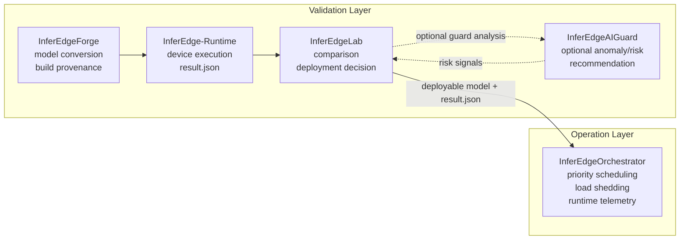

# InferEdgeOrchestrator

InferEdgeOrchestrator is a lightweight runtime scheduler for running multiple
edge inference tasks with explicit priority, latency budget, queue, and load
shedding policies.

It is not a Triton or DeepStream replacement. The goal is to show how a
constrained edge device can protect high-priority inference workloads when
latency spikes, queue backlog, and frame drops appear under overload.

Portfolio positioning: Triton/DeepStream 대체가 아니라 lightweight edge scheduler.

## Relationship to InferEdge

InferEdge is the deployment validation pipeline. It handles model conversion,
runtime result collection, analysis, and deployment decisions.

InferEdgeOrchestrator is the runtime operation control layer. It starts after a
model is considered deployable and controls how multiple inference tasks behave
when they run together on a constrained device.

## Ecosystem Lifecycle



The lifecycle boundary is intentional:

- InferEdge answers whether a model is safe and reasonable to deploy.
- InferEdgeOrchestrator controls how deployed inference tasks behave together.
- The integration is file-based through `result.json`, not direct imports between
  projects.

## Why Not Triton or DeepStream?

InferEdgeOrchestrator is not a general-purpose inference server, media pipeline,
or deployment platform. It is a small scheduler-focused runtime layer for
showing how overload control works on constrained edge devices.

Triton and DeepStream are strong production systems when the goal is broad model
serving, stream processing, or GPU-optimized deployment. This project has a
different portfolio purpose: it makes scheduling decisions visible and testable.
The code directly models per-task priority, bounded queues, drop policy,
deadline pressure, and telemetry so the behavior can be explained from first
principles.

In short, this repository demonstrates runtime operation control, not platform
replacement.

## Validation Results

These results are split into two categories on purpose. The synthetic overload
scenario validates the scheduler and load shedding policy in a deterministic
setting. The Jetson smoke run validates that the orchestrator CLI and telemetry
path run on actual edge hardware.

### Synthetic Overload Scenario

Command:

```bash
python3 -m inferedge_orchestrator compare-overload \
  --config configs/phase3_overload.json \
  --output reports/phase3_overload.json \
  --frames 20
```

| Mode | Detector executed | Detector dropped | Detector p95 end-to-end latency | Classifier executed | Classifier dropped | Overload events |
| --- | ---: | ---: | ---: | ---: | ---: | ---: |
| FIFO baseline | 20 | 0 | 782.0ms | 20 | 0 | 0 |
| Scheduler + load shedding | 20 | 0 | 8.0ms | 4 | 16 | 16 |

Result: low-priority classifier drops increased under overload, but the
high-priority detector stayed within the intended latency budget. The p95
end-to-end latency improvement for detector was `774.0ms` in this deterministic
policy validation run.

### Jetson Smoke Validation

Command:

```bash
CAPTURE_TEGRASTATS=1 scripts/smoke_jetson_dummy.sh
```

| Item | Value |
| --- | --- |
| Device | `nano01` |
| OS / L4T | `Ubuntu 22.04.5 LTS`, `L4T R36.4.7` |
| Kernel | `Linux 5.15.148-tegra aarch64` |
| Python | `3.10.12` |
| Result | `PASS` |
| Telemetry | `reports/jetson_smoke_dummy.json` |
| Resource snapshots | `start`, `end` present |
| Optional tegrastats | parsed successfully |

| Task | Executed | Dropped | Mean latency | P95 latency | Max queue backlog |
| --- | ---: | ---: | ---: | ---: | ---: |
| detector | 20 | 0 | 8.0ms | 8.0ms | 1 |
| classifier | 2 | 18 | 32.0ms | 32.0ms | 2 |

Result: Jetson smoke validation confirmed that the CLI executes on device,
telemetry is generated, resource snapshots are recorded, and low-priority drops
are visible. This is smoke validation, not benchmark evidence.

## Phase 1 Scope

Phase 1 proves the scheduler policy without running real models.

- Task config schema
- Dummy frame source
- Bounded per-task queues
- Priority and deadline-aware scheduler
- Dummy worker
- Load shedding policy
- Telemetry JSON export
- Pytest coverage for scheduler, queue, shedding, and telemetry behavior

Phase 1 intentionally does not execute ONNX models. ONNX Runtime support belongs
to Phase 2.

## Phase 2 ONNX Runtime Smoke

Install the ONNX extras in your local environment:

```bash
python3 -m pip install -e '.[onnx,dev]'
```

Create a tiny identity model for smoke testing:

```bash
python3 scripts/create_identity_onnx.py --output models/identity.onnx
```

Run the ONNX Runtime worker demo:

```bash
python3 -m inferedge_orchestrator run \
  --config configs/phase2_onnx_demo.json \
  --output reports/phase2_onnx_demo.json \
  --frames 1
```

The `worker` field selects whether a task runs through the dummy worker or the
ONNX Runtime worker. Image and video inputs can be routed by setting
`run.input_source` to `image` or `video` with `run.input_path`.

## Phase 3 Overload Scenario

Run the overload comparison:

```bash
python3 -m inferedge_orchestrator compare-overload \
  --config configs/phase3_overload.json \
  --output reports/phase3_overload.json \
  --frames 20
```

The comparison writes a no-scheduler FIFO baseline and a scheduled policy run to
the same JSON report. In the baseline, every task is processed in arrival order,
so a low-priority classifier can sit in front of a high-priority detector and
push up detector end-to-end latency. With priority scheduling and load shedding,
classifier drops increase under overload, but detector p95 end-to-end latency is
protected. This project is not a benchmark tool; the point is runtime stability
under competing edge inference work.

## Phase 4 Jetson Smoke Test

Run the dummy-input smoke on Jetson Orin Nano:

```bash
scripts/smoke_jetson_dummy.sh
```

Telemetry includes `resource_snapshots` at `start` and `end`. Optional
`tegrastats` output can be parsed with
`inferedge_orchestrator.monitor.parse_tegrastats_line`.

Canonical smoke artifacts:

- `reports/jetson_smoke_dummy.json`
- `reports/jetson_validation.md`
- optional `reports/tegrastats_smoke.log`

Device validation status:

- Local smoke and telemetry structure: validated by tests.
- Jetson Orin Nano physical-device run: validated on `nano01`.
- See `docs/jetson_smoke_test.md` for the exact command and validation record.

Latest Jetson smoke summary:

- Timestamp: `2026-05-04T12:44:02Z`
- Device: `Linux nano01 5.15.148-tegra aarch64`
- OS/L4T: `Ubuntu 22.04.5 LTS`, `L4T R36.4.7`
- Python: `3.10.12`
- Result: `PASS`
- Detector: `executed=20`, `dropped=0`, `p95_latency_ms=8.0`
- Classifier: `executed=2`, `dropped=18`, `p95_latency_ms=32.0`
- Resource snapshots: `start` and `end` entries present
- Optional `tegrastats` sample: parsed successfully

## Phase 5 InferEdge Integration

InferEdge remains the deployment validation pipeline. InferEdgeOrchestrator is
the runtime operation control layer. The projects are connected only through
files, not direct module imports.

Create an Orchestrator config from an InferEdge `result.json`:

```bash
python3 -m inferedge_orchestrator from-inferedge \
  --result examples/inferedge_result_sample.json \
  --output configs/from_inferedge.json \
  --task-name detector \
  --model-path models/detector.onnx \
  --priority 100 \
  --target-fps 15 \
  --queue-size 4
```

The helper reads `expected_latency_ms` and recommends `latency_budget_ms` using a
configurable multiplier. See `docs/inferedge_integration.md`.

## Quickstart

Run the tests:

```bash
python3 -m pytest
```

Run the Phase 1 demo:

```bash
python3 -m inferedge_orchestrator run \
  --config configs/phase1_demo.json \
  --output reports/phase1_demo.json \
  --frames 12
```

Print a telemetry summary:

```bash
python3 -m inferedge_orchestrator report --input reports/phase1_demo.json
```
