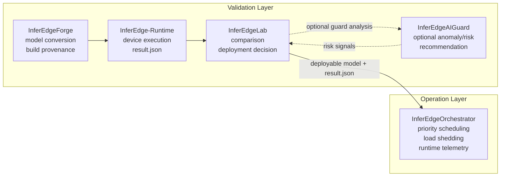

# InferEdgeOrchestrator

Language: English | [한국어](README.ko.md)

[](https://github.com/gwonxhj/InferEdgeOrchestrator/actions/workflows/ci.yml)

Release: [v0.1.2](https://github.com/gwonxhj/InferEdgeOrchestrator/releases/tag/v0.1.2)

InferEdgeOrchestrator is a lightweight runtime scheduler for constrained edge
devices. It controls multiple inference tasks after deployment, using
per-task priority, latency budgets, bounded queues, load shedding, and telemetry
so high-priority workloads stay responsive when backlog and latency spikes
appear.

It is not a Triton or DeepStream replacement. The project is a scheduler-focused
edge runtime layer that makes overload-control decisions explicit, testable, and
explainable.

Portfolio positioning: Triton/DeepStream 대체가 아니라 lightweight edge scheduler.

Portfolio brief: [PORTFOLIO.md](PORTFOLIO.md) ([한국어](PORTFOLIO.ko.md))

## 30-Second Read

- Solves the post-deployment operation problem: what runs first, what gets
  dropped, and why, when edge inference tasks contend for limited resources.
- Protects high-priority workloads with priority/deadline-aware scheduling,
  bounded queues, and adaptive load shedding.
- Records every important runtime decision in telemetry so overload behavior is
  inspectable instead of hand-waved.
- Validated with local pytest, synthetic overload comparison, Jetson dummy/ONNX
  smoke, and Jetson TensorRT-backed contention evidence.

## What It Does

| Runtime concern | Implementation |
| --- | --- |
| Multi-task inference | Config-driven task registration for detector/classifier/OCR-style workloads |
| Priority control | Priority and deadline-aware scheduling based on `priority` and `latency_budget_ms` |
| Backlog control | Bounded per-task queues with `drop_oldest`, `drop_newest`, and low-priority shedding behavior |
| Overload stability | Adaptive load shedding limits low-priority work to protect high-priority latency |
| Worker abstraction | Shared worker interface with `dummy`, `onnxruntime`, and TensorRT-backed workers |
| Runtime evidence | Telemetry JSON records executed/dropped counts, latency, backlog, result events, resource snapshots, and policy decisions |
| Edge validation | Jetson Orin Nano smoke scripts validate CLI, telemetry, `tegrastats` parsing, ONNX Runtime execution, and TensorRT-backed contention |

## Runtime Model

```text
Input Source
-> Frame Router
-> Bounded Task Queues
-> Priority + Deadline-Aware Scheduler
-> Inference Worker
-> Result Aggregator
-> Telemetry Logger
```

Each task is defined by operational policy:

```json
{
  "name": "detector",
  "model_path": "models/detector.onnx",
  "priority": 100,
  "target_fps": 15,
  "latency_budget_ms": 80,
  "queue_size": 4,
  "drop_policy": "drop_oldest",
  "worker": "dummy"
}
```

The scheduler's job is not to run every frame. It decides which task should run
next, which frames are stale enough to drop, and when low-priority work should
be limited so high-priority latency remains inside budget.

## InferEdge Boundary

InferEdge is the deployment validation pipeline. InferEdgeOrchestrator is the
runtime operation control layer.



The boundary is intentional:

- InferEdge answers whether a model is safe and reasonable to deploy.
- InferEdgeOrchestrator controls how deployed inference tasks behave together.
- The integration is file-based through `result.json`, not direct imports.

## Implementation Map

| Phase | Delivered capability | Evidence |
| --- | --- | --- |
| Phase 1: Scheduler Core | Config schema, dummy frame source, bounded queues, priority/deadline scheduler, dummy worker, load shedding, telemetry export | Pytest coverage for scheduler, queue, shedding, and telemetry |
| Phase 2: ONNX Runtime Worker | Config-selectable ONNX Runtime worker, identity ONNX smoke model, image/video input path support | `configs/phase2_onnx_demo.json`, `scripts/create_identity_onnx.py` |
| Phase 3: Overload Scenario | FIFO baseline vs scheduler/load-shedding comparison | `python3 -m inferedge_orchestrator compare-overload ...` |
| Phase 4: Jetson Smoke | Jetson CLI smoke, telemetry generation, resource snapshots, optional `tegrastats` parsing | `scripts/smoke_jetson_dummy.sh`, `scripts/smoke_jetson_onnx.sh` |
| Phase 5: InferEdge Handoff | `result.json` latency signal converted into Orchestrator task config | `python3 -m inferedge_orchestrator from-inferedge ...` |

## Validation Evidence

These results are lifecycle evidence, not benchmark claims. Smoke runs prove the
runtime paths execute on edge hardware; the synthetic overload run proves the
scheduler policy; the InferEdge handoff proves the validation-to-operation file
boundary.

| Evidence | Key result | Artifact |
| --- | --- | --- |
| Jetson dummy smoke | `nano01` generated telemetry, resource snapshots, and low-priority drops: detector `20/0`, classifier `2/18` executed/dropped | [`examples/telemetry/jetson_smoke_dummy_sample.json`](examples/telemetry/jetson_smoke_dummy_sample.json) |
| Jetson ONNX Runtime smoke | `onnxruntime` worker executed identity ONNX on Jetson with `CPUExecutionProvider`, output shape `[1, 2]`, 13 `tegrastats` samples | [`examples/telemetry/jetson_onnx_smoke_sample.json`](examples/telemetry/jetson_onnx_smoke_sample.json) |
| Jetson TensorRT inference smoke | Built `models/identity_fp16.plan` from identity ONNX on Jetson, executed one TensorRT identity frame, and confirmed runtime telemetry metadata: `PASS_TENSORRT_INFERENCE`, `PASS_TENSORRT_TELEMETRY` | [`docs/validation_evidence.md`](docs/validation_evidence.md) |
| Jetson TensorRT contention smoke | Ran high-priority and low-priority TensorRT tasks through scheduler/load-shedding contention: `PASS_TENSORRT_CONTENTION` | [`examples/telemetry/jetson_tensorrt_contention_sample.json`](examples/telemetry/jetson_tensorrt_contention_sample.json) |
| Jetson TensorRT diverse contention smoke | Ran distinct generated detector/classifier TensorRT engines through scheduler/load-shedding contention: detector `6/0`, classifier `1/5` executed/dropped, `5` overload events, `PASS_TENSORRT_DIVERSE_CONTENTION` | [`examples/telemetry/jetson_tensorrt_diverse_contention_sample.json`](examples/telemetry/jetson_tensorrt_diverse_contention_sample.json) |
| Synthetic overload comparison | Detector p95 end-to-end latency improved from `782.0ms` FIFO baseline to `8.0ms` with scheduler + shedding; classifier dropped `16` low-priority frames | [`examples/telemetry/phase3_overload_sample.json`](examples/telemetry/phase3_overload_sample.json) |
| InferEdge result handoff | Sample `expected_latency_ms=42.2` produced recommended `latency_budget_ms=64.0` without importing InferEdge internals | `configs/from_inferedge.json` |

Versioned sample telemetry artifacts are available in
[`examples/telemetry/`](examples/telemetry/README.md).
For the full evidence index, see
[`docs/validation_evidence.md`](docs/validation_evidence.md).

### Jetson Smoke Commands

```bash
CAPTURE_TEGRASTATS=1 scripts/smoke_jetson_dummy.sh
```

```bash
PYTHON_BIN=$HOME/miniconda3/envs/yolo_env/bin/python \
  CAPTURE_TEGRASTATS=1 \
  scripts/smoke_jetson_onnx.sh
```

Latest device records:

| Smoke | Device | OS / L4T | Python | Result | Note |
| --- | --- | --- | --- | --- | --- |
| Dummy scheduler smoke | `nano01` | `Ubuntu 22.04.5 LTS`, `L4T R36.4.7` | `3.10.12` | `PASS` | CLI, telemetry, resource snapshots, low-priority drops |
| ONNX Runtime smoke | `nano01` | `Ubuntu 22.04.5 LTS`, `L4T R36.4.7` | `3.10.12` | `PASS` | ONNX Runtime `1.23.2`, `CPUExecutionProvider`, output metadata recorded |

These smoke records validate worker, scheduler, telemetry, and Jetson execution
paths. They are not TensorRT/GPU throughput benchmarks.

### Overload Comparison

```bash
python3 -m inferedge_orchestrator compare-overload \
  --config configs/phase3_overload.json \
  --output reports/phase3_overload.json \
  --frames 20
```

| Mode | Detector executed | Detector dropped | Detector p95 end-to-end latency | Classifier executed | Classifier dropped | Overload events |
| --- | ---: | ---: | ---: | ---: | ---: | ---: |
| FIFO baseline | 20 | 0 | 782.0ms | 20 | 0 | 0 |
| Scheduler + load shedding | 20 | 0 | 8.0ms | 4 | 16 | 16 |

This is the core scheduler story: low-priority classifier work is intentionally
dropped under overload so the high-priority detector stays within latency
budget.

### InferEdge Handoff

```bash
python3 -m inferedge_orchestrator from-inferedge \
  --result examples/inferedge_result_sample.json \
  --output configs/from_inferedge.json \
  --task-name detector \
  --model-path models/detector.onnx \
  --priority 100 \
  --target-fps 15 \
  --queue-size 4
```

The helper reads InferEdge `result.json` latency signals and recommends an
initial `latency_budget_ms` for Orchestrator task policy. This keeps validation
and operation control connected by artifacts while keeping the repositories
separate.

## Quickstart

Install the local package with test dependencies:

```bash
python3 -m pip install -e '.[dev]'
```

Run the tests:

```bash
python3 -m pytest
```

Run the scheduler demo:

```bash
python3 -m inferedge_orchestrator run \
  --config configs/phase1_demo.json \
  --output reports/phase1_demo.json \
  --frames 12
```

Run the ONNX Runtime demo:

```bash
python3 -m pip install -e '.[onnx,dev]'
python3 scripts/create_identity_onnx.py --output models/identity.onnx

python3 -m inferedge_orchestrator run \
  --config configs/phase2_onnx_demo.json \
  --output reports/phase2_onnx_demo.json \
  --frames 1
```

Print a telemetry summary:

```bash
python3 -m inferedge_orchestrator report --input reports/phase1_demo.json
```

For more detail, see:

- [`CHANGELOG.md`](CHANGELOG.md)
- [`PORTFOLIO.md`](PORTFOLIO.md)
- [`configs/README.md`](configs/README.md)
- [`examples/telemetry/README.md`](examples/telemetry/README.md)
- [`docs/validation_evidence.md`](docs/validation_evidence.md)
- [`docs/architecture.md`](docs/architecture.md)
- [`docs/jetson_smoke_test.md`](docs/jetson_smoke_test.md)
- [`docs/inferedge_integration.md`](docs/inferedge_integration.md)
- [`docs/tensorrt_backend.md`](docs/tensorrt_backend.md)
- [`docs/tensorrt_engine_build.md`](docs/tensorrt_engine_build.md)
- [`docs/tensorrt_model_diversity.md`](docs/tensorrt_model_diversity.md)
